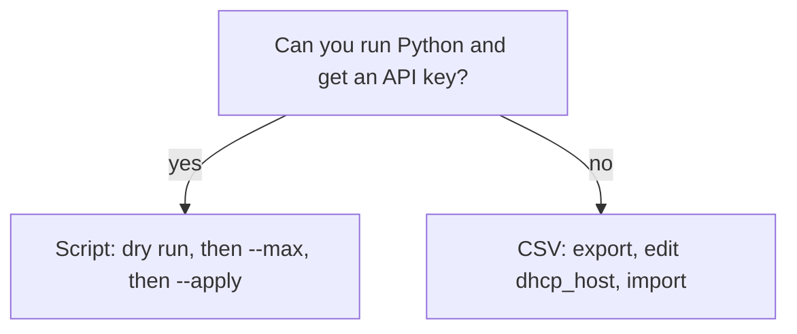
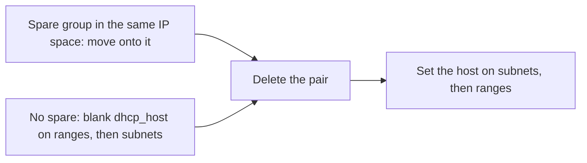

# infoblox-ha-move

[](https://www.python.org/)
[](#)
[](https://csp.infoblox.com/)
[](#)

Move subnets and their DHCP ranges from one DHCP host or HA group to another
in Infoblox Universal DDI. One script, one field changed, a dry run every time
until you say `--apply`. A move of a few objects takes seconds; you end up with
every subnet and range on the new host or pair and a CSV report of what changed.

> [!WARNING]
> **`move_ha_group.py` is not an Infoblox product.** It is not written,
> supported, endorsed or distributed by Infoblox. It calls the public Universal
> DDI API and changes live DHCP configuration. Read it before you run it, run
> the dry run first, start with `--max`, and use it at your own risk. Provided
> as-is, with no warranty and no liability for anything it does to your tenant.

> [!WARNING]
> **Ranges do not move with their subnet, and leases do not move at all.** The
> range is what hands out leases, so move both. Clients keep their address until
> renewal, and at renewal may keep it, get another, or get none. Assign ranges
> before leases start expiring. That last part is Infoblox guidance and was not
> tested here.

> Lab work in a vendor tenant, September 2026. The script was run many times
> against at most six objects. The CSV method was run twice on one subnet and
> one range. Nothing here has touched a production tenant. Start with a small
> sample in your own environment.

## Quick start

`--old` and `--new` take an HA group or a DHCP host, by name, spelled as the
portal spells it. By default you do not list the subnets: the script finds every
subnet and range whose `dhcp_host` is `--old` and points it at `--new`. Replace
`site-a-dhcp01` and `SITE-AB-HA` below with names from your own step 2.

1. Get the script, then make an API key with write access at Portal > your name > User Profile > API Keys and put it in your shell.

   ```bash
   # download the repo and go into it
   git clone https://github.com/holland-built/infoblox-ha-move.git && cd infoblox-ha-move
   ```

   ```bash
   # put your key where the script reads it; this shell only
   export INFOBLOX_API_KEY='<your-key>'
   ```

2. Get the exact names. Groups and hosts are two lists.

   ```bash
   # print every HA group with its id
   python3 move_ha_group.py --list-ha-groups
   ```

   ```bash
   # print every DHCP host with its type and id
   python3 move_ha_group.py --list-hosts
   ```

3. Dry run. It prints the plan, writes `ha-move-report.csv`, and changes nothing.

   ```bash
   # show what would move from the old host or pair to the new one
   python3 move_ha_group.py --old "site-a-dhcp01" --new "SITE-AB-HA"
   ```

4. Pilot about five objects, then check them in the portal. The cap takes a subnet with all its ranges, so it can go over five. The Edit dialog shows the assignment; the side panel does not.

   ```bash
   # move about five objects, then re-read and report anything left behind
   python3 move_ha_group.py --old "site-a-dhcp01" --new "SITE-AB-HA" --max 5 --apply --verify
   ```

5. Move the rest. With no `--subnet` or `--space`, this takes everything still on the old host or pair.

   ```bash
   # move everything still on the old host or pair
   python3 move_ha_group.py --old "site-a-dhcp01" --new "SITE-AB-HA" --apply --verify
   ```

To undo, run the same command with the names swapped.

```bash
# put everything now on the pair back onto the host
python3 move_ha_group.py --old "SITE-AB-HA" --new "site-a-dhcp01" --apply --verify
```

> [!WARNING]
> The undo moves everything now on the pair, including anything that was there
> before your move. If the pair already served subnets, add `--subnet` for each
> one you moved, and read the dry run before applying.

## What you need

| Where | Needs |
|---|---|
| Your machine | Python 3.7 or newer, standard library only |
| Infoblox portal | An API key with write access |
| Network | HTTPS to `csp.infoblox.com` |

## Repo layout

| Path | Holds |
|---|---|
| `move_ha_group.py` | The whole tool |
| `README.md` | This page |
| `ha-move-report.csv` | Written by a move or fix run that finds something, one row per object. Ignored by git |

<details>
<summary><b>Read first: the one field this changes</b></summary>

A range with no `dhcp_host` of its own serves nothing. It does not inherit one
from its subnet. That is Infoblox's answer; we did not watch it happen. What we
did see is that such a range is invisible to any search for "things on the old
group", so no move finds it. The script lists these separately, and
`--fix-ranges` sets them.

The portal calls this field Service Instance. The API field and the CSV column
are both named `dhcp_host`. Same field, two names. It is the only field either
method changes.

| Value | Means |
|---|---|
| `DC2-DHCP-HA` | An HA group, by name, exactly as the portal spells it, spaces included |
| `site-a-dhcp01` | A DHCP host, by name. One host running DHCP, which is what a site has before anyone builds a pair for it |
| *(empty)* | Nothing serves this object. On a range, that means no leases |

One field, two kinds of value. A site on one host and a site on an HA group are
therefore the same job.

Use the name. The API calls groups `dhcp/ha_group/<uuid>` and hosts
`dhcp/host/<number>`, and the script takes those through `--old-id` and
`--new-id`, but the CSV column takes the name.

`dhcp/host` is a different list from the appliances under `infra/host`. In one
lab tenant it held 167 rows against 101 there. Read the DHCP list.

</details>

<details>
<summary><b>Script or CSV import</b></summary>



| | Script | CSV import |
|---|---|---|
| Needs | Python 3.7+, an API key, HTTPS to `csp.infoblox.com` | Portal access |
| Shows the plan before writing | Yes, every run is a dry run until `--apply` | No. You diff the two files yourself |
| Limit the blast radius | `--max`, `--subnet`, `--space` | Trim the file by hand |
| Different subnets to different targets in one run | No. One source and one target per run | Yes, `dhcp_host` is a per-row value. Untested |
| Time | Seconds; the plan is a filtered query | About 15 minutes per import. An export took about 16 minutes |
| Can delete things | No. It only changes `dhcp_host` | One import type removes every object missing from your file. Never pick it |

Both methods edit the same field. If you cannot install Python, use the CSV
method; installing Python is out of scope here.

Before moving an old pair, consider editing it instead. If a pair has lost a
host, open it in the portal, swap the dead host for the new one, and rename it.
Every subnet on it follows with no subnet edits. Which is less work depends on
the counts, so read both dry runs first.

</details>

<details>
<summary><b>The API key</b></summary>

Make one at Portal > your name > User Profile > API Keys, with write access.
Expired keys fail with `401`; make a new one rather than re-pasting.

The export lives only in the shell that ran it. In a terminal window you export
once, then run the script in that same window. Inside an agent or a CI step each
line often gets a fresh shell, so put both on one line:

```bash
# set the key and run the script in the same shell
export INFOBLOX_API_KEY='<your-key>' && python3 move_ha_group.py --list-ha-groups
```

To ask the shell you are about to run in whether the key is set (this prints
the length, never the key):

```bash
# say whether the key is set in this shell, without showing it
[ -n "$INFOBLOX_API_KEY" ] && echo "set, ${#INFOBLOX_API_KEY} characters" || echo "not set in this shell"
```

`not set` means the export did not reach this shell. Export it again here.

A set variable is not a working key. `--list-ha-groups` is the real test: it
either lists your groups or fails with `401`, which means the key is wrong or
expired.

</details>

<details>
<summary><b>Options</b></summary>

| Flag | Meaning | Example |
|---|---|---|
| `--apply` | Writes. Without it, every run is a dry run | `--apply` |
| `--space NAME` | Only objects in one IP space | `--space Corporate` |
| `--subnet CIDR` | Only this subnet and its ranges. Repeat for more | `--subnet 10.20.30.0/24` |
| `--max N` | Cap the run at about N objects | `--max 5` |
| `--verify` | Re-read afterwards; report anything left on the old group | `--verify` |
| `--list-ha-groups` | Print every HA group with its id, then exit | `--list-ha-groups` |
| `--list-hosts` | Print every DHCP host with its id, then exit | `--list-hosts` |
| `--fix-ranges` | A separate job, not a move. See Fix ranges that serve nothing | `--fix-ranges --old "<name>"` |
| `--report` | Where to write the per-object CSV | `--report pilot.csv` |
| `--old-id`, `--new-id` | A resource id instead of a name | `--old-id dhcp/ha_group/1a2b...` |

### Choosing which subnets move

Without a filter the run takes everything on the source. That is right when you
are retiring a group and wrong for the commoner job of moving one site.

| Add | Moves |
|---|---|
| `--space "Corporate"` | One IP space |
| `--subnet 10.20.30.0/24` | One subnet and its ranges |
| `--subnet 10.20.30.0/24 --subnet 10.40.0.0/16` | Several |

A named subnet always brings its own ranges. Leaving a range behind is the
mistake this tool exists to stop, so it is not offered.

Narrowing happens before `--max`, so the cap counts what is left.

Verified: a run with `--subnet` moved that subnet and its range and left the
other subnet on the source untouched.

### How the cap counts

`--max` is the blast-radius control. Use it on the first run: move five, check
them in the portal, then run again without it.

It counts objects. A subnet is one object and each range is another. It takes
whole units: a subnet with every range inside it, or a lone range whose parent
subnet is not moving. It never splits a subnet from its ranges, so the count is
approximate.

Say the old group holds this, and you pass `--max 5`:

| Unit | Objects | `--max 5` |
|---|---|---|
| Subnet A + 2 ranges | 3 | moves, 3 used |
| Subnet B + 4 ranges | 5 | skipped, 3 + 5 is over 5 |
| Subnet C, no ranges | 1 | moves, 4 used |
| Lone range in a subnet staying put | 1 | moves, 5 used |

Five objects moved, out of ten. A skipped unit does not stop the run; the script
keeps going and takes later units that still fit.

The first unit is always taken, even when it is bigger than N on its own.
`--max 2` against a subnet with six ranges moves all seven objects.

You do not choose which units. Run the dry run first and read the report to see
what the next run would take.

</details>

<details>
<summary><b>Worked example: a host or pair to a pair, with output</b></summary>

Site A runs one DHCP host, `site-a-dhcp01`. A new pair, `SITE-AB-HA`, is built
and ready. Every subnet and range on the host moves onto the pair.

Pair to pair is this same walkthrough. Only the name after `--old` changes.

`--old` and `--new` take an HA group or a DHCP host, either side, in any
combination. The script works out which kind it is. A name that exists as both
is refused rather than guessed at; use `--old-id` and `--new-id` to settle
that, or any time you would rather be exact.

### 1. Get the exact names

```bash
# print every DHCP host: name, type, IP space, id
python3 move_ha_group.py --list-hosts
```

A `nios_ddi` host cannot serve a subnet, and is refused before any write:

```
site-a-dhcp01                uddi       Corporate   dhcp/host/10001
site-b-dhcp01                uddi       Corporate   dhcp/host/10002
site-c-dhcp01                nios_ddi   -           dhcp/host/10003
```

```bash
# print every HA group: name, mode, IP space, id
python3 move_ha_group.py --list-ha-groups
```

```
SITE-AB-HA         active-passive   Corporate   dhcp/ha_group/9f8e...
SITE-B-HA-OLD      active-passive   Corporate   dhcp/ha_group/1a2b...
```

Copy the names from that output. Every object you move must sit in the target's
IP space. The script checks each one before it writes, and the server refuses a
mismatch anyway.

### 2. Dry run

```bash
# read the tenant and print the plan; nothing is written
python3 move_ha_group.py --old "site-a-dhcp01" --new "SITE-AB-HA"
```

```
From : site-a-dhcp01  (DHCP host, dhcp/host/10001)
To   : SITE-AB-HA  (HA group, dhcp/ha_group/9f8e...)
       target IP space: Corporate
Mode : DRY RUN - no changes

  subnets to move: 4
  ranges  to move: 6

  subnet  10.20.30.0/24                        Floor 2 data
  range   10.20.30.50-10.20.30.200             Floor 2 pool

DRY RUN complete. Nothing was changed.
Full plan written to: /path/ha-move-report.csv
```

A dry run sends no writes. It writes one local file, `ha-move-report.csv`, with
a row per object. Read that file before step 3.

Watch for a warning about ranges with no `dhcp_host`. Those are dark today and a
move will not touch them. See Fix ranges that serve nothing.

### 3. Pilot five, then check

```bash
# move about five objects, then re-read and report what is left
python3 move_ha_group.py --old "site-a-dhcp01" --new "SITE-AB-HA" --max 5 --apply --verify
```

Open those five in the portal. The Edit dialog shows the assignment; the side
panel does not.

### 4. The rest, then confirm

```bash
# move everything still on the host, then re-read and report what is left
python3 move_ha_group.py --old "site-a-dhcp01" --new "SITE-AB-HA" --apply --verify
```

`--verify` re-reads afterwards and prints what is still on the source.

### 5. Undo, if you need it

```bash
# names swapped: move everything now on the pair back onto the host
python3 move_ha_group.py --old "SITE-AB-HA" --new "site-a-dhcp01" --apply --verify
```

Each run builds its plan from the current state, so this finds everything now
on the pair. That is not always the same set: anything else already on the pair
comes back with yours. If the pair held objects before your move, add
`--subnet` to name only what you moved, and read the dry run before applying.

### Group to group

Identical, with a group name on both sides:

```bash
# move everything on the old pair onto the new pair
python3 move_ha_group.py --old "SITE-B-HA-OLD" --new "SITE-AB-HA" --apply --verify
```

The dry run, `--max`, `--verify`, and the swapped command to undo it all apply
unchanged.

### Two sites at once

One new pair, two sources: one run per source, the same target both times.

### Different subnets to different groups

The script does one source and one target per run. For two targets, run it
twice. It cannot send some subnets on one source one way and the rest another
way. The CSV method can, since `dhcp_host` is a per-row value, so one file can
send row A to one group and row B to another. We have not tested a mixed file.

</details>

<details>
<summary><b>Pair to one of its own hosts: leaving HA</b></summary>

Pair `SITE-C-HA` runs on `site-c-dhcp01` and `site-c-dhcp02`. The pair goes;
`site-c-dhcp01` stays.

**A host in a pair cannot serve subnets of its own.** Infoblox documents this
for Active/Active and Active/Passive groups, in
[Configuring High Availability](https://docs.infoblox.com/space/BloxOneDDI/186617244).
So `--old "SITE-C-HA" --new "site-c-dhcp01"` passes the dry run and fails on
`--apply` with `HTTP 400`. The range stays with its subnet.

A pair in use cannot be deleted either. That is not in the docs; the lab got
`Cannot delete this HA Group because it is serving a Subnet/Range in the IP Space: <space>`.

So the order is: empty the pair, delete it, then assign the host. Deleting the
group freed both hosts. Run on an Active/Active pair, one subnet and one range.



With a spare group or host in the same IP space, `SPARE-HA` here:

```bash
# 1. park everything from the pair on the spare group
python3 move_ha_group.py --old "SITE-C-HA" --new "SPARE-HA" --apply --verify
```

Then delete `SITE-C-HA` in the portal.

```bash
# 2. move it from the spare group onto the host that stays
python3 move_ha_group.py --old "SPARE-HA" --new "site-c-dhcp01" --apply --verify
```

Dry run each move just before applying it: the same command without
`--apply --verify`. The second dry run only finds your subnets once the first
move has put them on `SPARE-HA`. If `SPARE-HA` already serves subnets, add
`--subnet` to the second run.

Without a spare, in a maintenance window: empty `dhcp_host` on every range, then
every subnet, delete the group, then set the host on every subnet, then every
range. Ranges must match their subnet, per the same page. The script does not
empty a field or delete a group, so use the portal or the API. Run through the
API only.

Untested: leases at renewal, and emptying the field by CSV import.

</details>

<details>
<summary><b>Fix ranges that serve nothing</b></summary>

A range hands out leases only when its own `dhcp_host` is set. An empty one
serves nothing, and it does not inherit from its subnet. Nothing points those
ranges at the source, so a move cannot see them and only warns.

Any move run tells you, dry run included:

```
  WARNING: 2 range(s) inside these subnets have no dhcp_host of their own.
           A range serves leases only when its own dhcp_host is set, so
           these are not serving now and this tool does not change them.
             10.0.0.2-10.0.0.4
             10.0.0.5-10.0.0.10
```

Those two hand out no leases today. They did not break during the move; they
were already dark.

`--fix-ranges` gives each one the value its own parent subnet uses. Dry run
first, as always:

```bash
# list every range under this group's subnets that has no dhcp_host; nothing is written
python3 move_ha_group.py --fix-ranges --old "DC2-DHCP-HA"
```

```
On   : DC2-DHCP-HA  (HA group, dhcp/ha_group/1a2b...)
Mode : DRY RUN - no changes

Reading subnets and ranges ...
  subnets found: 4

  ranges with no dhcp_host: 2

  10.0.0.2-10.0.0.4                  -> dhcp/ha_group/1a2b...
  10.0.0.5-10.0.0.10                 -> dhcp/ha_group/1a2b...

DRY RUN complete. Nothing was changed.
```

Then write them:

```bash
# give each of those ranges its parent subnet's dhcp_host, then re-check
python3 move_ha_group.py --fix-ranges --old "DC2-DHCP-HA" --apply --verify
```

```
Applied. set=2 failed=0 skipped=0

Verifying ...
  Clean: every range inside those subnets now has a dhcp_host.
```

| | |
|---|---|
| Takes | `--old` or `--old-id`, naming an HA group or a DHCP host |
| Refuses | `--new`. The value comes from each range's own subnet |
| Writes | Only with `--apply`. Without it, a dry run and a report |
| Pairing | `--verify` needs `--apply`. On a dry run it is refused, since a dry run already shows what is outstanding |
| Caps | `--max N` is a plain count here. A range has nothing under it |
| Skips | A range that gained a value since the plan was built |
| Skips | A range whose parent subnet has moved since the plan was built |
| Undo | Set `dhcp_host` back to empty. Tested through the API, `null` or `""` |
| Quiet | A run that finds nothing writes no report. It says so and stops |

Run it before the move and the ranges carry the old name, so the move sees them
and everything lands together. Run it after and they get the new name directly.
Either order works.

It is a separate run on purpose. A move rewrites a field that already has a
value; this fills a field that is empty. One run, one kind of undo.

</details>

> [!WARNING]
> **CSV import type must be "Add new records and update existing records."**
> Never one with "delete" in the label: by their own wording those remove every
> object missing from the imported file, and your file is trimmed. We did not
> test one. A rollback import also restores every column of those rows, not
> just `dhcp_host`, so it silently undoes any other edit made since the export.

<details>
<summary><b>CSV fallback: export, edit one column, import</b></summary>

Service Instance in the portal is `dhcp_host` in the CSV. That one column
carries the assignment, and it is the only column to touch. It sits on two
header rows, and you edit it on both:

```
HEADER-ipamdhcp-v3-subnet,key,name,comment,space,...,dhcp_host,...
HEADER-ipamdhcp-v3-range,key,space,start,end,...,dhcp_host,...
```

The value is a name, spelled as the portal spells it: `SITE-AB-HA` for a pair,
`site-a-dhcp01` for a lone host. Both kinds go in that same column, so a site on
one host and a site on a pair are the same edit. A `nios_ddi` host is refused
here too, by the same server rule.

`move.csv` and `rollback.csv` are the same rows, twice. `rollback.csv` is the
untouched copy, straight from the export. `move.csv` is the copy where you set
`dhcp_host` to the new pair.

You do not need one file per source. `dhcp_host` is a per-row value, so rows off
a lone host and rows off an old pair go in the same `move.csv` and take the same
new value. Rows could equally carry different values and send different subnets
to different pairs, which the script cannot do. We have not tested a mixed
file.

| Step | Do this | Watch for |
|---|---|---|
| 1. Export | Integrations > Data Import / Export > Export. Tick Subnets and Ranges, CSV, skip failed records | No filter: you get the whole tenant. A previous export took about 16 minutes per its job history; the two imports we timed took about 15 minutes each |
| 2. Two files | Copy the download to `rollback.csv` and trim it to the subnets you are moving and their range rows. Copy that to `move.csv` | Keep both `HEADER-` lines untouched. Rows you delete are never visited by an add-and-update import |
| 3. Edit `move.csv` | Set `dhcp_host` to the new group's name on every subnet and range row. Change nothing else | Do not blank the cell. We do not know what an empty value does on import and did not test it |
| 4. Diff | Compare `move.csv` against `rollback.csv` | Only `dhcp_host` should differ, only on data rows. Note your row counts |
| 5. Import | Import tab, pick `move.csv`, tick Subnets and Ranges, import type as in the warning above, skip failed records, Start | Another 15 minutes or so |
| 6. Check | Counts match your row numbers, error log empty, spot-check one subnet and one range | Wait for Import complete first: an unreached type shows `0 of 0`, which looks like finding none. Use the Edit dialog; the side panel never showed HA group |

Anything wrong: import `rollback.csv` the same way. If anyone changed anything
else on those objects since the export, re-export first, or put `dhcp_host`
back by hand.

</details>

<details>
<summary><b>What the lab tenant actually did</b></summary>

Server rules, as the lab met them:

| Rule | What happened |
|---|---|
| An HA group holds exactly two hosts, always | Sending one is refused with `Expects two hosts in the group`, and `port` in the payload is refused as read only. A host cannot be freed from a group; the group has to go first |
| A pair cannot hand its subnets straight to one of its own hosts | Dry run passed, `--apply` failed with `HTTP 400`. Matches [Configuring High Availability](https://docs.infoblox.com/space/BloxOneDDI/186617244) |
| An HA group in use cannot be deleted | Refused with `Cannot delete this HA Group because it is serving a Subnet/Range in the IP Space: <space>`. Empty, it deleted and freed both hosts, and both routes in Pair to one of its own hosts worked. Not in the docs |
| Not every DHCP host can serve a subnet | A host has a `type`. Any type but `nios_ddi` works. A `nios_ddi` host is refused on every write with `Cannot assign host of type: NIOS DDI to Subnet object`. That tenant held 48 of those against 119 that work, which is also why `dhcp/host` outnumbers `infra/host`. `--list-hosts` prints the type, and a `nios_ddi` target is refused before anything is written |
| A host already in an HA group cannot be a subnet's `dhcp_host` | Refused on create and on edit alike, with `The Host is already assigned to a HA Group`. Point the subnet at the group instead, which works |
| One HA group serves one IP space, through its hosts | The server enforces it. A subnet from another space is refused with an error naming both spaces |
| Every object on a group is in one IP space | Aiming at a group whose hosts serve another space refuses the whole run instead of moving part of the set. Inferred from one refusal, not stated by Infoblox |
| A target reporting no IP space is decided by the server | A newly built group has nothing assigned yet and so reports no IP space, which makes the script skip its own precheck and let the writes go. One such group took them. A newly built group in an earlier round refused them, so the skip cost a failed run, not a wrong one. The skip buys you the server's answer, per object, and nothing more |
| A `dhcp_host` can be emptied through the API | `null` and `""` both leave it null, and setting it again restores it. So switching a range off is a real undo for `--fix-ranges`. This is the API; the CSV import is still untested here |

What the script did:

| Run | Result |
|---|---|
| A DHCP host as the source, both ways | With `--apply`, two subnets and a range moved off a host onto an HA group: three objects changed, none failed, `--verify` clean. The swapped command put all three back on the host. Two of the three were pre-existing, not built for the test |
| A DHCP host as the target | Every rollback wrote one: two subnets and a range went from an HA group back onto a host, `HTTP 200` each, twice over. All four directions have been written |
| `--fix-ranges` | Two ranges serving nothing were set to their parent subnet's host, `set=2 failed=0`, and `--verify` came back clean. Both were then put back as they were |
| Reversing a partial run | Each run rebuilds its plan from the current state, so after moving three of six objects with `--max` the swapped command found exactly those three. That was a capped run, with no interruption and no real error. If you do interrupt one, the report is still written, and a fresh dry run shows where things actually stand |
| `--verify` | After a narrowed run it names the flag that narrowed it and exits 0. After a run that asked for everything, anything left is called out as unexpected and the exit code is 1. Objects the server refused, and ranges held back with them, are reported as not moved, separately from leftovers that appeared during the run |
| Speed | The plan comes from a filtered query, so it returns quickly even on a large tenant. That filter is undocumented by Infoblox; if it stops working the script says so and falls back to reading every subnet and range, which takes minutes. The fallback covers a rejected filter, `400` or `422`. Any other failure stops the run instead of quietly reading everything |
| Scale | Untested. Writes are throttled to about five a second, so a large move is paced by that rather than by the API. Nothing bigger than six objects has been run |

</details>

<details>
<summary><b>Not tested</b></summary>

Either method past six objects. Live leases; there were no clients on the lab
range. A real mid-run error; recovery from an artificial one works. Blanking a
`dhcp_host` cell in a CSV. A delete-type import.

We did not run an export in this round, only the two imports. The export screen
was inspected directly and offers no filter; the 16 minute figure comes from
this tenant's export job history rather than from a run we timed.

</details>

Portal paths correct September 2026.
